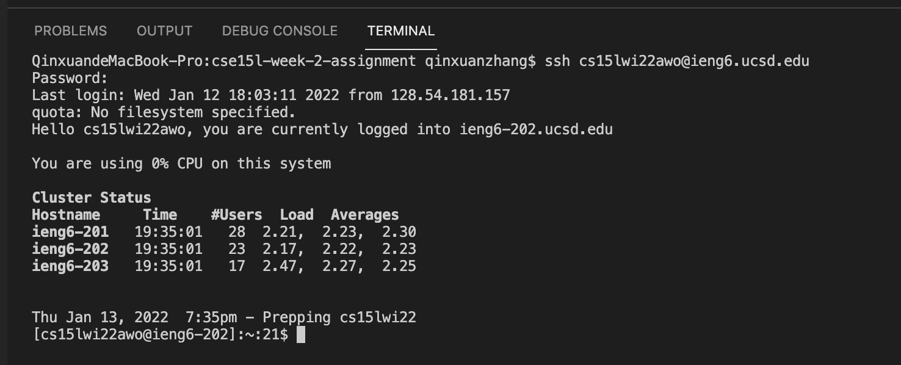

Step1: 

- install the vscode from the website
- get started

Step2:

- log in to my CSE15L account on ieng6
- need to change passward for the first log-in to activate the account

Step3:

- command "ls" lists the contents of the current directory
- command "ls -lat" lists the contents, including the hidden files in the long format

Step4:

- use command "scp" to move the c++ source file "hello.cpp" to my ieng6 account
- the file can be compiled and runned after being moved

Step5:

Step6:
